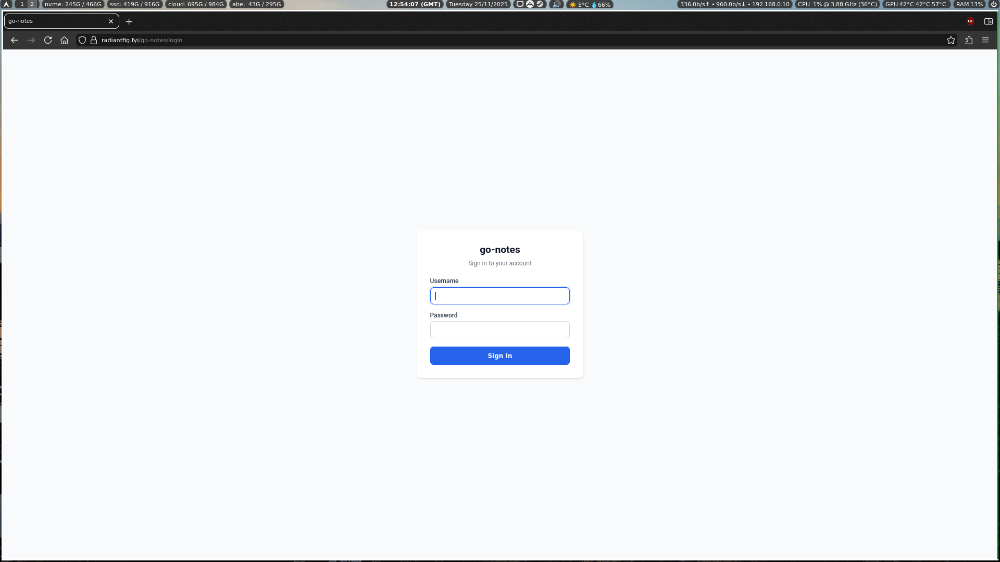
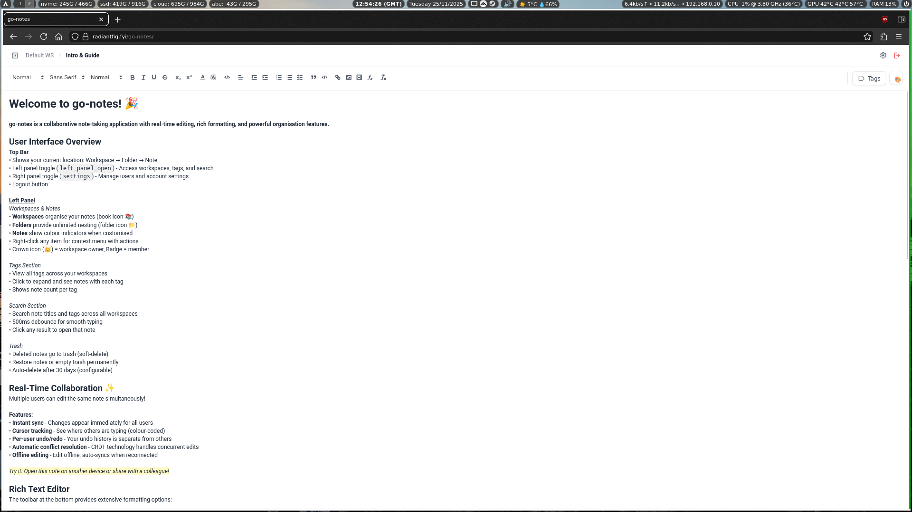
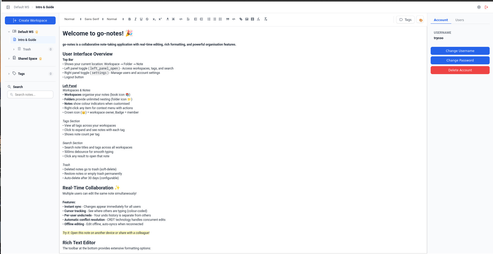

# go-notes

A modern collaborative note-taking application with real-time editing. Multiple users can edit the same note simultaneously with automatic conflict resolution.

## ✨ Features

- **Real-time collaboration** - Edit notes together with live cursor tracking
- **Rich text editor** - Full formatting, code blocks, lists, images, LaTeX
- **Workspaces & folders** - Organize notes with unlimited nesting
- **Tags & search** - Quick note discovery across workspaces
- **User management** - Multi-user with workspace sharing
- **Offline support** - Edit offline, auto-syncs when reconnected
- **Trash system** - Soft-delete with restore capability
- **💻 Desktop app** - Native Electron app for Linux, Windows, macOS
- **📱 Android app** - Native mobile client with offline caching

## Screenshots

<p align="center">
  
  
  
</p>

## Quick Start

### Server Installation

1. **Create directory and download files**
```bash
   mkdir go-notes && cd go-notes
   wget https://raw.githubusercontent.com/TheFozid/go-notes/main/docker-compose.yml
   wget https://raw.githubusercontent.com/TheFozid/go-notes/main/.env.example -O .env
```

2. **Configure** (edit .env)
```bash
   nano .env
```
   
   **Required changes:**
   - Change `JWT_SECRET` to a random string
   - Change `DB_PASSWORD` to a secure password
   - Optionally change `API_BASE_PATH` (default: `/go-notes`)

3. **Start**
```bash
   docker compose pull
   docker compose up -d
```

4. **Access**
   - Open: `http://localhost:8060/go-notes/`
   - Create your admin account

### Update Server
```bash
cd go-notes
docker compose pull
docker compose up -d
```

---

## 💻 Desktop App

Native Electron application for Linux, Windows, and macOS.

### Features
- Server configuration screen
- Offline caching
- Connection status indicator
- Change server menu option
- Native desktop performance

### Installation

#### Arch Linux (AUR)
```bash
yay -S go-notes
# or
paru -S go-notes
```

#### Other Linux Distributions
Download the **AppImage** from [GitHub Releases](https://github.com/TheFozid/go-notes/releases/latest):
```bash
# Download and make executable
chmod +x go-notes-*-linux-x86_64.AppImage

# Run
./go-notes-*-linux-x86_64.AppImage
```

Or extract the **tar.gz** to install manually.

#### Windows
Download from [GitHub Releases](https://github.com/TheFozid/go-notes/releases/latest):
- **Setup installer** (recommended): `go-notes-*-windows-install.exe`
- **Portable version**: `go-notes-*-windows-portable.exe` (no installation required)

### First Launch
1. Open the app
2. Enter your go-notes server URL
   - Example: `https://notes.yourdomain.com/go-notes`
   - Or local: `http://192.168.1.100:8060/go-notes`
3. Login with your credentials

### Offline Access
The desktop app caches the interface and previously viewed content for offline viewing. When offline:
- ✅ View previously loaded notes (read-only)
- ✅ Navigate through cached workspaces
- ❌ Cannot create or edit notes
- ❌ Cannot sync changes

Content automatically syncs when connection is restored.

---

## 📱 Android App

Native Android client for accessing go-notes on mobile devices.

### Features
- Configure custom server URL
- Offline caching (read-only)
- Connection status indicator (red bars when offline)
- Change server option via menu
- Native Android performance

### Download

**[Download go-notes-android.apk](https://github.com/TheFozid/go-notes/releases/latest)** from GitHub Releases

### Installation

1. Download the APK on your Android device
2. Enable "Install from unknown sources" in Android settings
3. Open the APK file to install
4. Launch the app and enter your go-notes server URL
   - Example: `https://notes.yourdomain.com/go-notes`
   - Or local: `http://192.168.1.100:8060/go-notes`
5. Login with your credentials

### Requirements
- Android 8.0+ (API 26+)
- Access to a go-notes server (local network or public domain)

### Offline Access
Same offline capabilities as desktop app - read-only access to cached content.

---

## 🌐 Reverse Proxy (Nginx)

To access go-notes via a domain with SSL:
```nginx
location /go-notes/ {
    proxy_pass http://192.168.0.4:8060/go-notes/;
    
    # WebSocket support (required for real-time collaboration)
    proxy_http_version 1.1;
    proxy_set_header Upgrade $http_upgrade;
    proxy_set_header Connection "upgrade";
    
    # Standard proxy headers
    proxy_set_header Host $host;
    proxy_set_header X-Real-IP $remote_addr;
    proxy_set_header X-Forwarded-For $proxy_add_x_forwarded_for;
    proxy_set_header X-Forwarded-Proto $scheme;
    
    # Timeouts for WebSocket connections
    proxy_connect_timeout 7d;
    proxy_send_timeout 7d;
    proxy_read_timeout 7d;
    
    # Disable buffering for real-time updates
    proxy_buffering off;
}
```

**Apply the config:**
```bash
sudo nano /etc/nginx/sites-available/default
# Add location block inside server block
sudo nginx -t
sudo systemctl reload nginx
```

Replace `192.168.0.4:8060` with your actual server IP/hostname and port.

## ⚙️ Configuration

### Environment Variables (.env)
```bash
# Server Configuration
PORT=8060                    # Internal port
API_BASE_PATH=/go-notes      # URL subpath

# Security (CHANGE THESE!)
JWT_SECRET=change-me-in-production
DB_PASSWORD=notespass

# Database
DB_USER=notes
DB_NAME=notesdb

# Features
TRASH_AUTO_DELETE_DAYS=30    # Auto-delete trashed notes after X days
```

### Changing the Base Path

To use a different URL path (e.g., `/notes` instead of `/go-notes`):

1. Edit `.env`:
```bash
   API_BASE_PATH=/notes
```

2. Restart:
```bash
   docker compose down
   docker compose up -d
```

3. Update your nginx `location` block to match:
```nginx
   location /notes/ {
       proxy_pass http://192.168.0.4:8060/notes/;
       ...
```

## 🛠️ Management

### View logs
```bash
docker compose logs -f
```

### Stop application
```bash
docker compose down
```

### Restart application
```bash
docker compose restart
```

### Backup database
```bash
docker compose exec db pg_dump -U notes notesdb > backup.sql
```

### Restore database
```bash
cat backup.sql | docker compose exec -T db psql -U notes notesdb
```

### Complete reset (deletes all data)
```bash
docker compose down -v
docker compose up -d
```

## 🏗️ Architecture

**Three-service deployment:**
- **PostgreSQL** - Stores metadata and document content
- **Go Backend** - REST API, authentication, WebSocket proxy
- **Hocuspocus (Node.js)** - Real-time collaboration server

All services run in Docker containers and communicate via internal network.

## 🔒 Security Checklist

Before production deployment:

- [ ] Change `JWT_SECRET` to a strong random value
- [ ] Use strong `DB_PASSWORD`
- [ ] Set up SSL/TLS (Let's Encrypt recommended)
- [ ] Configure firewall (only expose 80/443)
- [ ] Set up regular database backups
- [ ] Keep Docker images updated

## 📊 System Requirements

**Server:**
- Minimum: 1 CPU core, 512MB RAM, 2GB disk, Docker & Docker Compose
- Recommended: 2 CPU cores, 2GB RAM, 10GB disk

**Desktop App:**
- Linux (x86_64), Windows 10+, or macOS 10.13+
- ~200MB disk space

**Android App:**
- Android 8.0+ (API 26+)
- ~10MB disk space

## Troubleshooting

### Application won't start
```bash
# Check logs
docker compose logs

# Verify containers are running
docker compose ps
```

### Can't access via browser
- Check firewall allows port 8060
- Verify `API_BASE_PATH` in .env matches URL
- Check nginx config if using reverse proxy

### Real-time collaboration not working
- Ensure WebSocket support in nginx config
- Check browser console for WebSocket errors
- Verify no firewall blocking WebSocket upgrades

### Database errors
```bash
# Check database is healthy
docker compose exec db psql -U notes -l

# Restart services
docker compose restart
```

### Desktop/Android app issues
- **Can't connect:** Verify server URL includes protocol (http:// or https://)
- **Offline content missing:** Content only cached after viewing while online
- **Connection status stuck red:** Check device network settings

## 📚 Additional Documentation

For developers and advanced configuration, see the `docs/` directory:
- **architecture.md** - Technical system design
- **requirements.md** - Feature specifications
- **roadmap.md** - Future development plans

## Contributing

Contributions welcome! Please open an issue or pull request on GitHub.

**Repository:** https://github.com/TheFozid/go-notes

## 📄 License

MIT License - see [LICENSE](LICENSE) file for details.

## 🙏 Acknowledgments

Built with:
- [Hocuspocus](https://tiptap.dev/hocuspocus) - Real-time collaboration
- [Y.js](https://yjs.dev/) - CRDT framework
- [Quill](https://quilljs.com/) - Rich text editor
- [Go](https://golang.org/) - Backend language
- [React](https://react.dev/) - Frontend framework
- [Electron](https://www.electronjs.org/) - Desktop platform
- [Android](https://developer.android.com/) - Mobile platform

---

<p align="center">
  <a href="https://buymeacoffee.com/danny_and_serin">
    
  </a>
</p>

**Made by [TheFozid](https://github.com/TheFozid)**
